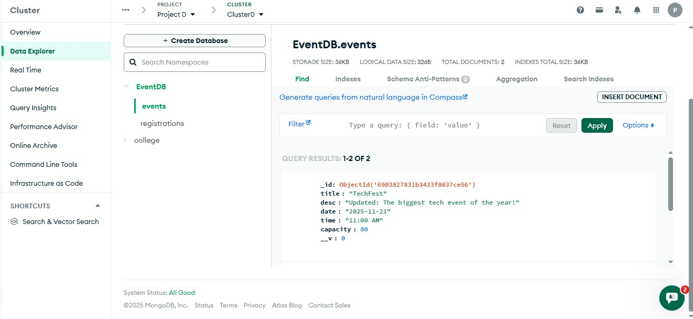
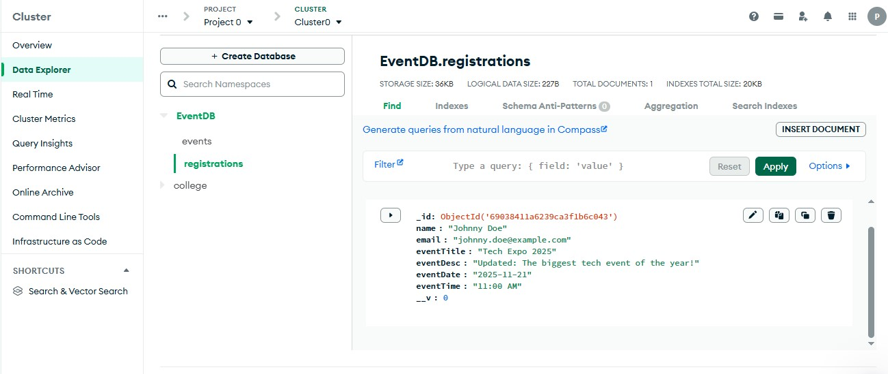

API needed for instagram chat feature

1234
prarthanapn


# 🎯 Synergia Event Registration & Booking System

This project is a simple **backend application** built using **Node.js, Express.js, MongoDB (Mongoose)**, and **Postman** for API testing.  
It allows users to **create events**, **register for events**, and **manage registrations**.  
I created this project to understand how to build REST APIs, connect Node.js with MongoDB, and perform CRUD operations.

---

## 🧩 Project Overview

The system has two main parts:

1. **Event Management** – where new events can be created, updated, retrieved, and deleted.  
2. **Registration Management** – where users can register for events, view all registrations, update their details, and delete their registration.

All data is stored in a **MongoDB Atlas cluster**.

---

## ⚙️ Tech Stack

- **Node.js** – JavaScript runtime for backend logic  
- **Express.js** – Web framework for building APIs  
- **MongoDB Atlas** – Cloud database for storing events and registrations  
- **Mongoose** – ODM to interact with MongoDB  
- **Postman** – For API testing and debugging  
- **dotenv** – To manage environment variables securely

---

---

## ⚙️ Setup Instructions

### 1️⃣ Clone the project
```bash
git clone https://github.com/<your-username>/Synergia_Event_Booking.git
cd Synergia_Event_Booking
```

### 2️⃣ Install dependencies
```bash
npm install
```

### 3️⃣ Create a `.env` file
Inside your project folder, create a file named `.env` and add your MongoDB URI:
```
MONGO_URI=mongodb+srv://<username>:<password>@cluster0.ouwcqv9.mongodb.net/EventDB
```

### 4️⃣ Run the server
```bash
node index.js
```
Server runs on:  
👉 **http://localhost:3000**

---

## 🚀 API Endpoints (Tested using Postman)

### **Event APIs**
| Method | Endpoint | Description |
|--------|-----------|-------------|
| POST   | `/postevent` | Add a new event |
| GET    | `/getevent` | Retrieve all events |
| PUT    | `/updateevent` | Update event details |
| DELETE | `/deleteevent` | Delete an event |

**Sample Body for `/postevent`**
```json
{
  "title": "Tech Talk 2025",
  "desc": "A seminar on AI and Cloud",
  "date": "2025-11-15",
  "time": "10:00 AM",
  "capacity": 100
}
```

---

### **Registration APIs**
| Method | Endpoint | Description |
|--------|-----------|-------------|
| POST   | `/registration` | Register a user for an event |
| GET    | `/getregistration` | Get all registrations |
| POST   | `/getoneregistration` | Get one registration by name |
| PUT    | `/updateregistration` | Update registration details |
| DELETE | `/deleteregistration` | Delete a registration |

**Sample Body for `/registration`**
```json
{
  "name": "Prarthana",
  "email": "prarthana@gmail.com",
  "eventTitle": "Tech Talk 2025"
}
```

---

## 🧠 What I Learned

- How to use **Express** to create REST APIs  
- How to connect **MongoDB Atlas** using **Mongoose**  
- Performing **CRUD operations** on MongoDB  
- How to manage environment variables using **dotenv**  
- Using **Postman** effectively to test routes  
- Understanding the flow of data from request → validation → database → response  

---

## 📸 Database Screenshots

- **Events Collection:**  
  

- **Registration Collection:**  
  

---

## 🧾 Postman Collection

I have exported all API requests into a single file named **`postman_collection.json`**.  
This makes it easy to import into Postman and test all routes.

---

## 💡 Conclusion

This project helped me gain confidence in backend development and database integration.  
I now understand how to design APIs, handle data, and work with MongoDB using Node.js.

---
**Developed by:** *Prarthana P N*  
📅 *Advanced Backend Development Skill Lab Project*
---
